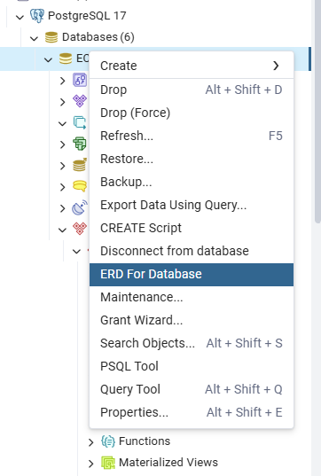

## ***Bu proje TechCareer.net Yaz-Kampı SQL Dersi için hazırlanmıştır.***

### *Hazırlayan: Fatma Göven*
#### **Ortam: [*PostgreSQL*](https://www.postgresql.org/)**
#### **Projenin amacı:** Bir E-Ticaret platformunu modellemektir
#### **Senaryo:** E-Ticaret platformu müşteri,ürün,kategori,satıcı,sipariş ve sipariş detay adlı tabloları içeren bir SQL tabloları ile oluşturulmuştur.
###### *NOT: SQL kodları içerisindeki açıklamalar,tablo isimleri ve değerler İngilizce ile ifade edilmiştir.*

#### Tablo açıklamaları aşağıdaki gibidir. 

#### **TABLOLAR:**
- **Customer** *(Müşteri Tablosu)*
- **Product** *(Ürün Tablosu)*
- **Category** *(Kategori Tablosu)*
- **Seller** *(Satıcı Tablosu)*
- **Orders** *(Sipariş Tablosu)*
- **OrderDetails** *(Sipariş Detayı Tablosu)*

-------------------------------------------------------------------

#### **3.Adım Adım Görevlere Göre Projenin Dosyalandırılması:**
#####  *Görev-ProjeKlasörü-Dosya* şeklindedir.

- **A. Veri Tabanı Tasarımı**
    - **A-CreateTableMethods:**
        - ***A-CreateMethods.sql*** --> *Tablo oluşturma sorgularını içerir. Bu sql dosyasında tüm tabloların create methodları tablo columnlarını içerir ve ilgili kısıtlara uyacak şekildedir.*
- **B.Veri Ekleme ve Güncelleme**
    - **B-InsertMethods:**
        - ***B-Category.sql*** --> *Kategori Tablosu Insert Methodları* 
        - ***B-Customer.sql*** --> *Müşteri Tablosu Insert Methodları* 
        - ***B-DataUpdateAndAdd.sql*** --> *UPDATE,DELETE,TRUNCATE Methodlarının kullanım örneklerinin olduğu dosya* 
        - ***B-OrderDetail.sql*** --> *Sipariş Detayı Tablosu Insert Methodları* 
        - ***B-Orders.sql*** --> *Sipariş Tablosu Insert Methodları* 
        - ***B-Product.sql*** --> *Ürün Tablosu Insert Methodları* 
        - ***B-Seller.sql*** --> *Satıcı Tablosu Insert Methodları* 
        - ***B-trigger_cust.sql*** --> *Müşteri Tablosuna eklenen DATE değeri için yazılmış trigger methodları* ***(Not1'e bknz)*** 
        - ***B-trigger_funct.sql*** --> *Müşteri Tablosuna eklenen DATE değeri için yazılmış trigger methodları* ***(Not1'e bknz)*** 

- **C.Veri Sorgulama ve Raporlama**
    - **C-Queries:**
        - ***C-Aggregate-GroupbyQueries.sql*** --> *Aggregate & Group By Sorgularını içerir.* ***(Not2'ye bknz)*** 
        - ***C-BasicQueries.sql*** --> *Temel Sorguları içerir.* ***(Not2'ye bknz)*** 
        - ***C-JoinQueries.sql*** --> *JOIN Sorgularını içerir.* ***(Not2'ye bknz)*** 
- **D.İleri Seviye Görevler(Opsiyonel)**
    - **D-AdvancedQueries:**
        - ***D-OptionalQueries.sql*** --> *İleri Seviye Görevlerdeki Sorguları içerir.* ***(Not3'e bknz)*** 
- **ER Diyagramı**

    - ERDiagram.pgerd --> [*PostgreSQL*](https://www.postgresql.org/)'de otomatik oluşturulmuştur. ***(Not4'e bknz)*** 
    - ERDiagram.png --> Ekran görüntüsüdür
-------------------------------------------------------------------
### ***NOTLAR:***

**NOT1:** 

B. kısmında ***INSERT*** methodları *https://www.mockaroo.com/* adresinden ilgili sütun ve tablo değerlerine göre otomatik oluşturulmuştur. Senaryoya göre datalar üretilirken bazı kısıtlar *Formulas* seçeneği ile eklenmiştir. ***DATE*** değerleri tabloya eklenirken ***DEFAULT*** eklenmesinde zorluk yaşandığımdan, öncelikle tabloya bu değerleri ***NULL*** olarak bastırılmasını istedim. Ardından trigger ile ***NULL*** ifade varsa yerine ***DEFAULT*** ekle şartını çalıştırabildim. Bu sayede Tablo Constraint'inde bulunan ***DEFAULT*** ise ***CURRENT_DATE*** eklenme şartı sağlanmış oldu. Bu konuda *[chatgpt](https://chatgpt.com/)*'den destek aldım.

**NOT2:** 
    Sorgular aşağıdaki gibidir.

    1. Temel Sorgular: 
        - En çok sipariş veren 5 müşteri. 
        - En çok satılan ürünler.
        - En yüksek cirosu olan satıcılar. 
    2. Aggregate & Group By: 
        - Şehirlere göre müşteri sayısı. 
        - Kategori bazlı toplam satışlar. 
        - Aylara göre sipariş sayısı. 
    3. JOIN’ler: 
        - Siparişlerde müşteri bilgisi + ürün bilgisi + satıcı bilgisi. 
        - Hiç satılmamış ürünler. 
        - Hiç sipariş vermemiş müşteriler.
**NOT3:** 
    Sorgular aşağıdaki gibidir.

    1. İleri Seviye Görevler (Opsiyonel):
    - En çok kazanç sağlayan ilk 3 kategori. 
    - Ortalama sipariş tutarını geçen siparişleri bul. 
    - En az bir kez elektronik ürün satın alan müşteriler.

**NOT4:** 
    [*PostgreSQL*](https://www.postgresql.org/)'de ER Diagramları aşağıdaki şekilde otomatik olarak oluşturulabilir.
    
